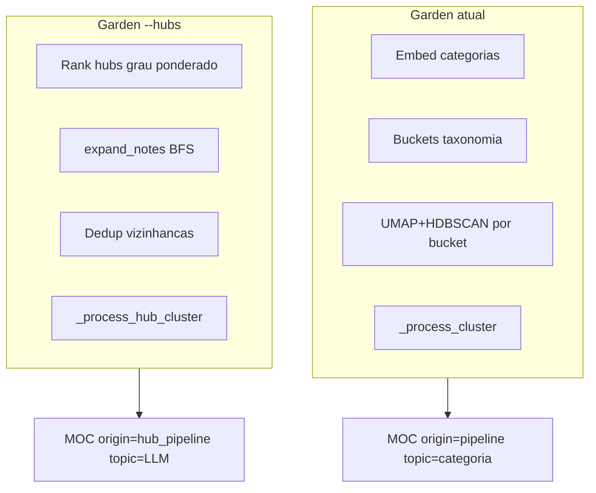

# Plano: MOCs por Hub (porta de entrada tematica)

> **Status:** implementado. Este documento descreve a arquitetura e decisoes de produto.

## Contexto e motivacao

O gardener hibrido (`zettel/gardener.py` + `zettel/gardener_assign.py`) organiza MOCs **top-down** por taxonomia e similaridade de embedding. Notas altamente conectadas no grafo (`note_connections`, populado por `connect` e `sync-manual`) representam **temas emergentes** — portas de entrada naturais no Zettelkasten.

Esta feature e **complementar**, nao substituta: MOCs de categoria cobrem o guarda-chuva curricular; MOCs hub cobrem "por onde comecar a navegar este tema".



## Decisoes de produto

| Decisao | Escolha |
|---------|---------|
| CLI | Flag `--hubs` em `zettel garden` |
| Topic do MOC | LLM deriva tema a partir do hub + vizinhanca (`moc_hub_generation.md`) |
| Coexistencia | Nota pode aparecer em MOC de categoria **e** MOC hub |
| strict_topics | **Desligado** para MOCs hub |

## Arquitetura

### Selecao de hubs

- `StateDB.get_weighted_note_degrees()` — grau undirected ponderado por `relation_type`
- `rank_note_hubs()` — filtra notas em `30_Permanent/`, modo `percentile` ou `absolute`
- Hubs ja ancorados em MOCs `hub_pipeline` sao re-incluidos para update incremental

### Vizinhanca

- `build_hub_neighborhood()` — reutiliza `expand_notes` de `graph.py`
- `dedup_hub_neighborhoods()` — descarta hubs menores cuja vizinhanca e >= 80% contida em outra

### Orquestracao

- `run_garden_hubs()` em `zettel/gardener_hub.py`
- `_process_hub_cluster`: hub existente → incremental; senao assinatura → skip; senao generation
- `purge_hub_pipeline_mocs()` — apaga apenas `origin='hub_pipeline'`

### Persistencia

```yaml
type: moc
origin: hub_pipeline
hub_note_id: "01ARZ3N..."
hub_weighted_degree: 12.5
topic: "Tema derivado pelo LLM"
```

Corpo: secao **Porta de entrada** com wikilink do hub + subsecoes do LLM.

## Configuracao (`hub_mocs.*`)

| Parametro | Default | Proposito |
|-----------|---------|-----------|
| `selection_mode` | `percentile` | `percentile` ou `absolute` |
| `hub_percentile` | `0.90` | Top 10% no modo percentile |
| `top_n_hubs` | `20` | Teto por run |
| `min_weighted_degree` | `8.0` | Limiar no modo absolute |
| `max_hops` | `2` | BFS a partir do hub |
| `max_neighbors` | `25` | Teto de notas no cluster |
| `min_neighbors` | `3` | Minimo para processar |
| `decay` | `0.5` | Atenuacao por hop |
| `min_neighbor_weight` | `0.3` | Filtro pos-BFS |
| `dedup_subset_threshold` | `0.8` | Dedup de vizinhancas |

## Uso

```bash
python -m zettel garden              # MOCs taxonomia
python -m zettel garden --hubs       # MOCs hub (complementar)
python -m zettel garden --hubs --recreate -y
```

## Pre-requisitos operacionais

- Grafo populado: `connect` + `sync-manual --rebuild-graph`
- Minimo ~20-30 notas permanentes com conexoes para hubs significativos
- Calibrar `hub_percentile` / `min_weighted_degree` apos primeira execucao

## Escopo fora da v1

- Rodar taxonomia + hubs na mesma invocacao
- Community detection (Louvain)
- Penalidade de hub generico por embedding
- Fila de orfas

## Arquivos principais

| Arquivo | Papel |
|---------|-------|
| `zettel/gardener_hub.py` | Pipeline hub completo |
| `zettel/state.py` | `get_weighted_note_degrees`, `find_moc_by_hub_note_id`, `delete_hub_pipeline_mocs` |
| `zettel/config.py` | `HubMocsConfig` |
| `prompts/moc_hub_generation.md` | Prompt de criacao |
| `prompts/moc_hub_incremental.md` | Prompt de update |
| `tests/test_gardener_hub.py` | Testes unitarios |
